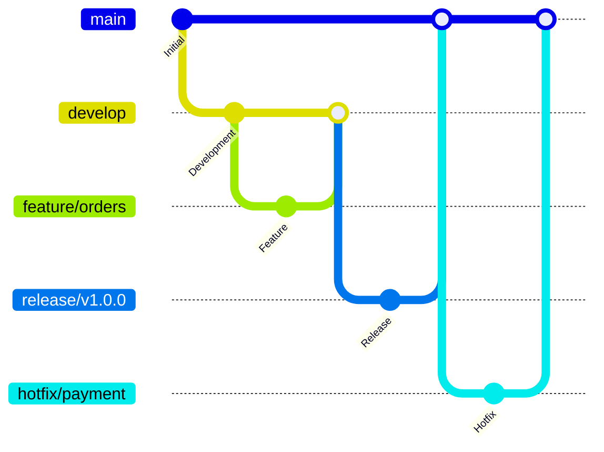
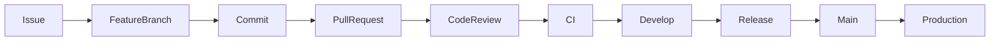
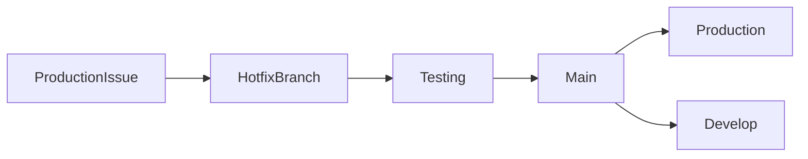

# 🌿 BRANCHING STRATEGY

> Official Git Branching Strategy for the Telepizza Platform.

---

# Document Information

| Property | Value |
|----------|-------|
| Project | Telepizza Platform |
| Module | Engineering Standards |
| Document | BRANCHING_STRATEGY.md |
| Version | 1.0.0 |
| Status | Final |
| Last Updated | 07 July 2026 |

---

# 1. Purpose

This document defines the official Git branching strategy used throughout the Telepizza Platform.

Objectives:

- Stable production releases
- Parallel development
- Safe collaboration
- Easy rollback
- AI-friendly workflow

---

# 2. Branch Overview



---

# 3. Main Branches

## main

Production-ready code only.

Rules:

- Protected branch
- Pull Requests only
- No direct commits
- Tagged releases

---

## develop

Integration branch.

All completed features are merged here before release.

---

# 4. Supporting Branches

Feature branches

```text
feature/auth

feature/orders

feature/payment

feature/inventory
```

Bug fixes

```text
bugfix/login-error

bugfix/payment-timeout
```

Release branches

```text
release/v1.0.0

release/v1.1.0
```

Hotfix branches

```text
hotfix/security-patch

hotfix/payment
```

Documentation

```text
docs/database

docs/api

docs/architecture
```

---

# 5. Branch Naming Rules

Format

```text
feature/<module>

bugfix/<issue>

hotfix/<issue>

release/<version>

docs/<topic>

refactor/<module>

test/<module>

chore/<task>
```

Examples

```text
feature/orders

feature/customer-app

bugfix/payment

release/v1.0.0

docs/database

refactor/inventory

chore/update-dependencies
```

---

# 6. Development Workflow



---

# 7. Pull Request Rules

Every PR must:

- Link to an issue or task
- Pass CI checks
- Pass linting
- Pass tests
- Include documentation updates (if applicable)
- Be approved before merge

---

# 8. Commit Standards

Use Conventional Commits.

Examples

```text
feat(auth): add refresh token support

fix(payment): resolve duplicate transaction

docs(api): update authentication examples

refactor(inventory): simplify stock service

test(order): add integration tests

chore(deps): update NestJS
```

---

# 9. Merge Strategy

Preferred:

```text
Squash and Merge
```

Reasons:

- Clean history
- Easier rollback
- Better release notes

Avoid unnecessary merge commits.

---

# 10. Release Process

1. Create release branch
2. Stabilize release
3. QA testing
4. Fix release issues
5. Merge to main
6. Tag version
7. Deploy to production
8. Merge back into develop

---

# 11. Hotfix Process



---

# 12. Protected Branch Rules

Protected branches:

- main
- develop

Restrictions:

- No force push
- No direct push
- Required reviews
- Required status checks
- Signed commits recommended

---

# 13. AI Development Workflow

AI-generated changes should:

1. Be created in a feature branch
2. Pass automated validation
3. Be reviewed by a developer
4. Pass CI/CD
5. Merge through Pull Request

AI must never commit directly to protected branches.

---

# 14. Version Tags

Use Semantic Versioning.

Examples

```text
v1.0.0

v1.1.0

v1.2.3

v2.0.0
```

---

# 15. Branch Lifecycle

```text
feature/*

↓

develop

↓

release/*

↓

main

↓

production
```

---

# 16. Related Documents

- CODING_STANDARDS.md
- CI_CD_PIPELINE.md
- DEVOPS_ARCHITECTURE.md
- IMPLEMENTATION_ROADMAP.md

---

© 2026 Telepizza Pakistan

Powered by Mianx.ai