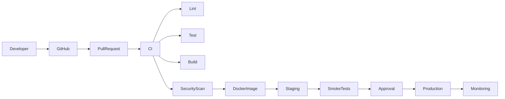
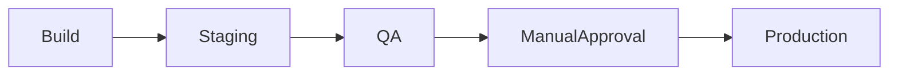

# 🔄 CI/CD PIPELINE

> Official Continuous Integration & Continuous Deployment (CI/CD) Pipeline for the Telepizza Platform.

---

# Document Information

| Property | Value |
|----------|-------|
| Project | Telepizza Platform |
| Module | DevOps |
| Document | CI_CD_PIPELINE.md |
| Version | 1.0.0 |
| Status | Final |
| Last Updated | 07 July 2026 |

---

# 1. Purpose

This document defines the CI/CD pipeline used to build, test, secure, package, and deploy the Telepizza Platform.

Goals:

- Automated Quality Assurance
- Faster Releases
- Safe Deployments
- Consistent Environments
- Rollback Capability
- Production Stability

---

# 2. Pipeline Overview



---

# 3. Trigger Events

Pipeline runs on:

- Pull Request
- Push to develop
- Push to main
- Release Tag
- Manual Dispatch

---

# 4. Continuous Integration

Every Pull Request automatically performs:

## Install

- Install Dependencies
- Restore Cache

---

## Validation

- ESLint
- Prettier
- Type Checking

---

## Testing

- Unit Tests
- Integration Tests
- API Tests

---

## Build

Build all applications:

- Backend
- Website
- Admin Panel
- Mobile (where applicable)

---

## Security

Run:

- Dependency Scan
- Secret Scan
- Static Code Analysis

---

# 5. Build Artifacts

Generate:

- Docker Images
- Build Logs
- Test Reports
- Coverage Reports

Artifacts should be versioned and retained according to project policy.

---

# 6. Continuous Deployment

Deployment flow:



---

# 7. Database Migration

Deployment order:

1. Backup Database
2. Apply Prisma Migrations
3. Verify Schema
4. Continue Deployment

Rollback procedures must be documented for each migration.

---

# 8. Docker Pipeline

Every deployment creates:

```text
frontend-image

backend-image

worker-image
```

Images are tagged with:

- Git Commit SHA
- Semantic Version
- Latest (optional)

---

# 9. Environment Promotion

```text
Development

↓

Staging

↓

Production
```

Only validated builds move to the next environment.

---

# 10. Quality Gates

Deployment stops if:

- Build fails
- Tests fail
- Lint fails
- Security scan fails
- Smoke tests fail

---

# 11. Smoke Tests

Verify:

- API Health
- Database Connectivity
- Authentication
- Redis
- Queue Workers
- AI Gateway
- Website Availability

---

# 12. Rollback

Rollback options:

- Previous Docker Image
- Previous Release Tag
- Feature Flag Disable
- Database Restore (if required)

---

# 13. Notifications

Notify deployment status through:

- Email
- Slack
- WhatsApp (optional)

Events:

- Build Started
- Build Failed
- Deployment Started
- Deployment Completed
- Rollback Triggered

---

# 14. Security Controls

CI/CD must enforce:

- Protected Branches
- Required Reviews
- Signed Commits (recommended)
- Secret Management
- Least-Privilege Deployment Tokens

---

# 15. Monitoring Integration

After deployment verify:

- Health Checks
- Error Rate
- Response Time
- Queue Status
- Database Performance

Automatically create alerts for failed deployments.

---

# 16. Versioning

Use Semantic Versioning.

Examples:

```text
v1.0.0

v1.1.0

v1.2.5

v2.0.0
```

---

# 17. Future Improvements

Future enhancements:

- Canary Deployments
- Blue-Green Deployments
- Progressive Rollouts
- GitOps
- Kubernetes Deployments

---

# 18. Related Documents

- DEVOPS_ARCHITECTURE.md
- DEPLOYMENT_ARCHITECTURE.md
- BRANCHING_STRATEGY.md
- MONITORING_ARCHITECTURE.md
- IMPLEMENTATION_ROADMAP.md

---

© 2026 Telepizza Pakistan

Powered by Mianx.ai