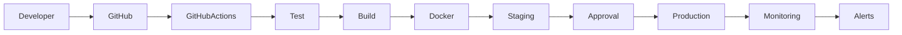
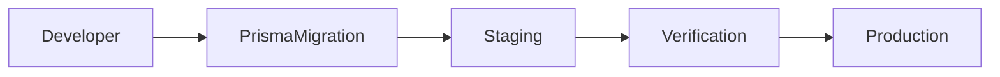

# ⚙️ DEVOPS ARCHITECTURE

> Official DevOps Architecture for the Telepizza Platform.

---

# Document Information

| Property | Value |
|----------|-------|
| Project | Telepizza Platform |
| Module | Architecture |
| Document | DEVOPS_ARCHITECTURE.md |
| Version | 1.0.0 |
| Status | Final |
| Last Updated | 07 July 2026 |

---

# 1. Purpose

This document defines the DevOps architecture, deployment workflow, automation strategy, environment management, and operational practices for the Telepizza Platform.

Goals:

- Automated deployments
- Reliable releases
- Fast rollback
- Secure secrets management
- Consistent environments
- Continuous testing
- High availability

---

# 2. DevOps Workflow



---

# 3. Branch Strategy

```text
main

develop

feature/*

bugfix/*

hotfix/*

release/*
```

Production code comes only from **main**.

---

# 4. CI Pipeline

Every pull request automatically runs:

- Install dependencies
- Lint
- Format check
- Unit tests
- Build verification
- Security scan

Only successful pipelines can be merged.

---

# 5. CD Pipeline

After merge to main:

- Build Docker images
- Push image to registry
- Run database migrations
- Deploy to staging
- Execute smoke tests
- Manual approval (production)
- Deploy to production
- Health verification

---

# 6. Docker Strategy

Containers:

```text
frontend

backend

postgres

redis

worker

nginx
```

Each service has its own Dockerfile.

---

# 7. Environment Management

Three environments:

```text
Development

Staging

Production
```

Each environment has independent:

- Database
- Redis
- Secrets
- Storage
- Configuration

---

# 8. Secrets Management

Secrets include:

- DATABASE_URL
- JWT_SECRET
- REDIS_URL
- SMTP_PASSWORD
- OPENAI_API_KEY

Rules:

- Never commit secrets to Git.
- Rotate credentials periodically.
- Limit access to production secrets.

---

# 9. Database Migrations

Migration flow:



Rules:

- Every schema change uses a migration.
- Test migrations in staging before production.
- Keep rollback procedures documented.

---

# 10. Deployment Strategy

Preferred strategy:

```text
Rolling Deployment
```

Benefits:

- Minimal downtime
- Easy rollback
- Gradual rollout

Blue/Green deployment can be adopted later if needed.

---

# 11. Rollback

Rollback includes:

- Previous Docker image
- Previous application version
- Database rollback (where safe)
- Feature flag disable

---

# 12. Infrastructure Automation

Automate:

- Builds
- Tests
- Deployments
- Database migrations
- Health checks
- Backup verification

---

# 13. Security

DevOps security practices:

- Signed commits (recommended)
- Branch protection
- Required reviews
- Dependency scanning
- Container image scanning
- Least-privilege deployment credentials

---

# 14. Monitoring Integration

After deployment verify:

- API health
- Database connectivity
- Queue workers
- AI Gateway
- Redis
- Error rate

Automatically alert on failures.

---

# 15. Disaster Recovery

Recovery steps:

1. Restore infrastructure
2. Restore database
3. Restore object storage
4. Restore secrets
5. Deploy latest verified release
6. Run health checks

---

# 16. Best Practices

- Small pull requests
- Automated testing
- Immutable builds
- Versioned releases
- Tagged Docker images
- Reproducible deployments
- Infrastructure documented

---

# 17. Future Improvements

Future enhancements:

- Kubernetes
- GitOps
- Infrastructure as Code
- Progressive deployments
- Canary releases

---

# 18. Related Documents

- DEPLOYMENT_ARCHITECTURE.md
- INFRASTRUCTURE_ARCHITECTURE.md
- MONITORING_ARCHITECTURE.md
- CI_CD_PIPELINE.md
- TECH_STACK.md

---

© 2026 Telepizza Pakistan

Powered by Mianx.ai