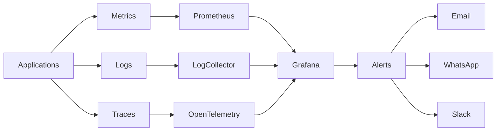

# 📊 MONITORING ARCHITECTURE

> Official Monitoring & Observability Architecture for the Telepizza Platform.

---

# Document Information

| Property | Value |
|----------|-------|
| Project | Telepizza Platform |
| Module | Architecture |
| Document | MONITORING_ARCHITECTURE.md |
| Version | 1.0.0 |
| Status | Final |
| Last Updated | 07 July 2026 |

---

# 1. Purpose

This document defines the monitoring, logging, tracing, alerting, and observability strategy for the Telepizza Platform.

Goals:

- High Availability
- Early Failure Detection
- Performance Monitoring
- Security Monitoring
- AI Usage Monitoring
- Infrastructure Health
- Business Metrics

---

# 2. Monitoring Architecture



---

# 3. Monitoring Layers

Application

- Backend API
- Website
- Mobile API
- Admin Panel
- POS
- Kitchen Dashboard

Infrastructure

- Server
- Docker
- PostgreSQL
- Redis
- Queue Workers

Business

- Orders
- Sales
- Inventory
- Deliveries
- AI Usage

---

# 4. Metrics Collection

Collect:

- CPU
- Memory
- Disk
- Network
- API Latency
- Queue Size
- Active Users
- Database Connections

---

# 5. Application Metrics

Backend

- Requests/sec
- Response Time
- Error Rate
- Active Sessions
- Authentication Failures

Website

- Page Load Time
- API Calls
- Errors

Mobile

- App Requests
- Sync Status
- API Errors

---

# 6. Database Monitoring

Monitor:

- Slow Queries
- Deadlocks
- Active Connections
- Replication Status
- Query Time
- Index Usage
- Storage Growth

---

# 7. Redis Monitoring

Track:

- Memory Usage
- Hit Ratio
- Evictions
- Connected Clients
- Queue Size

---

# 8. Queue Monitoring

Monitor:

- Pending Jobs
- Failed Jobs
- Retry Count
- Processing Time
- Dead Letter Queue

---

# 9. AI Monitoring

Track:

- AI Requests
- Success Rate
- Failure Rate
- Token Usage
- Cost
- Average Response Time
- Model Distribution

---

# 10. Business Monitoring

KPIs:

- Orders per Hour
- Revenue
- Delivery Time
- Kitchen Preparation Time
- Customer Satisfaction
- Refund Rate

---

# 11. Logging Strategy

All logs should include:

- Timestamp
- Request ID
- User ID
- Branch ID
- Service Name
- Log Level
- Message

Levels:

- INFO
- WARN
- ERROR
- DEBUG (development only)

---

# 12. Distributed Tracing

Use OpenTelemetry to trace:

- Incoming Request
- API Layer
- Database Calls
- External Services
- AI Provider Calls

Every request should have a Trace ID.

---

# 13. Alerting

Critical Alerts:

- API Down
- Database Down
- Redis Down
- Queue Failure
- High Error Rate
- Disk Full
- SSL Expiry
- Backup Failure

Notification Channels:

- Email
- WhatsApp
- Slack

---

# 14. Dashboards

Operations Dashboard

- Orders
- Deliveries
- Kitchen Status
- Active Riders

Technical Dashboard

- API
- Database
- Redis
- Queue
- AI

Executive Dashboard

- Sales
- Revenue
- Customer Growth
- Branch Performance

---

# 15. Health Checks

Endpoints:

```text
/health
/health/live
/health/ready
```

Check:

- API
- Database
- Redis
- Queue
- AI Gateway
- Storage

---

# 16. Retention Policy

Metrics

- 12 Months

Application Logs

- 90 Days

Audit Logs

- 5 Years

AI Usage

- 2 Years

---

# 17. Security Monitoring

Track:

- Failed Logins
- Suspicious Activity
- Permission Changes
- API Abuse
- Rate Limit Violations
- MFA Events

---

# 18. Future Enhancements

- Predictive Alerting
- AI-based Anomaly Detection
- Capacity Forecasting
- Auto Scaling Recommendations

---

# 19. Related Documents

- DEVOPS_ARCHITECTURE.md
- DEPLOYMENT_ARCHITECTURE.md
- INFRASTRUCTURE_ARCHITECTURE.md
- TECH_STACK.md
- CI_CD_PIPELINE.md

---

© 2026 Telepizza Pakistan

Powered by Mianx.ai