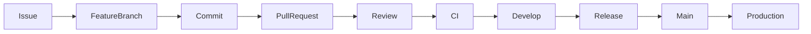

# 🌳 GIT STRATEGY

> Official Git Strategy for the Telepizza Platform.

---

# Document Information

| Property | Value |
|----------|-------|
| Project | Telepizza Platform |
| Module | Engineering Governance |
| Document | GIT_STRATEGY.md |
| Version | 1.0.0 |
| Status | Final |
| Last Updated | 07 July 2026 |

---

# 1. Purpose

This document defines the Git strategy used for source control, collaboration, releases, versioning, and AI-assisted development.

Objectives:

- Consistent development workflow
- Stable production releases
- Safe collaboration
- Traceable history
- Enterprise governance

---

# 2. Git Workflow



---

# 3. Repository Structure

Single Monorepo

```text
Telepizza-Platform/

apps/

backend/

packages/

database/

docs/

ai-agents/

scripts/

docker/

tests/
```

---

# 4. Protected Branches

Protected:

```text
main

develop
```

Rules:

- No direct push
- Pull Request required
- CI must pass
- Minimum one approval
- Signed commits recommended

---

# 5. Working Branches

```text
feature/*
bugfix/*
hotfix/*
release/*
docs/*
refactor/*
test/*
chore/*
```

Examples

```text
feature/orders
feature/payment-gateway
bugfix/login-timeout
hotfix/security-fix
docs/api
```

---

# 6. Commit Convention

Use Conventional Commits.

Examples

```text
feat(order): create order API

fix(payment): resolve duplicate charge

docs(database): update schema

refactor(auth): simplify JWT service

test(order): add integration tests

chore(deps): update Prisma
```

---

# 7. Pull Request Standards

Each PR must include:

- Summary
- Linked issue
- Testing performed
- Documentation updated
- Screenshots (UI changes)
- Breaking changes (if any)

---

# 8. Code Review Checklist

Reviewers verify:

- Architecture compliance
- Coding standards
- Security
- Performance
- Test coverage
- Documentation
- No duplicated logic

---

# 9. Release Strategy

Release flow

```text
develop

↓

release/v1.x.x

↓

main

↓

Production
```

Every production release must have a Git tag.

---

# 10. Versioning

Semantic Versioning

```text
MAJOR.MINOR.PATCH
```

Examples

```text
v1.0.0

v1.1.0

v1.1.5

v2.0.0
```

---

# 11. AI Development Rules

AI-generated changes:

- Must be created in feature branches
- Must pass CI
- Must be reviewed
- Must not push directly to protected branches
- Must follow project coding standards

---

# 12. Repository Policies

- Keep commits small and focused.
- Keep branches short-lived.
- Rebase frequently from `develop`.
- Delete merged branches.
- Never commit secrets.
- Never commit generated build artifacts unless intentionally tracked.

---

# 13. GitHub Configuration

Enable:

- Branch Protection
- Required Reviews
- Required Status Checks
- Dependency Alerts
- Secret Scanning
- Code Scanning
- Auto Delete Merged Branches

---

# 14. Tags

Release tags:

```text
v1.0.0

v1.1.0

v2.0.0
```

Pre-release tags:

```text
v2.0.0-alpha.1

v2.0.0-beta.1

v2.0.0-rc.1
```

---

# 15. Related Documents

- BRANCHING_STRATEGY.md
- CI_CD_PIPELINE.md
- CODING_STANDARDS.md
- DEVOPS_ARCHITECTURE.md

---

© 2026 Telepizza Pakistan

Powered by Mianx.ai