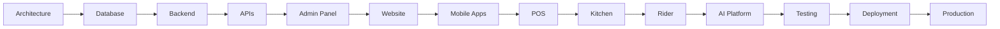

# 🚀 IMPLEMENTATION ROADMAP

> Official implementation roadmap for the Telepizza Platform.

---

# Document Information

| Property | Value |
|----------|-------|
| Project | Telepizza Platform |
| Module | Implementation |
| Document | IMPLEMENTATION_ROADMAP.md |
| Version | 1.0.0 |
| Status | Final |
| Last Updated | 07 July 2026 |

---

# 1. Purpose

This roadmap defines how the Telepizza Platform will be implemented from architecture to production.

Objectives:

- Controlled development
- Incremental delivery
- High quality
- Enterprise scalability
- AI-assisted development

---

# 2. High-Level Roadmap



---

# Phase 1 — Foundation ✅

Completed:

- Business Documentation
- Requirements
- Architecture
- Database Design
- API Design
- AI Architecture
- DevOps Planning

Deliverables:

- Documentation v1.0
- Repository Structure
- Development Standards

---

# Phase 2 — Development Foundation

Objectives:

- Initialize repository
- Configure workspace
- Configure Docker
- Configure Prisma
- Configure NestJS
- Configure Next.js
- Configure React Native
- Configure CI/CD

Deliverables:

- Working development environment
- Base project structure
- Initial pipelines

---

# Phase 3 — Database

Tasks:

- Create schema.prisma
- Create enums
- Create migrations
- Seed initial data
- Configure PostgreSQL

Deliverables:

- Executable database
- Seed data
- Migration history

Dependencies:

- Architecture complete

---

# Phase 4 — Backend

Modules:

- Auth
- Users
- Roles
- Branches
- Customers
- Menu
- Orders
- Payments
- Kitchen
- Delivery
- Inventory
- Suppliers
- Purchase
- Warehouse
- CRM
- HR
- Finance
- Reports
- Notifications
- Settings
- Audit
- AI

Deliverables:

- REST APIs
- Swagger Documentation
- Unit Tests

---

# Phase 5 — Frontend

Applications:

- Website
- Admin Panel

Deliverables:

- Authentication
- Dashboards
- Customer Portal
- Administration

---

# Phase 6 — Mobile

Applications:

- Customer App
- Rider App

Deliverables:

- Ordering
- Tracking
- Notifications
- Delivery Management

---

# Phase 7 — Restaurant Operations

Applications:

- POS
- Kitchen Dashboard

Deliverables:

- Order Processing
- Kitchen Workflow
- Billing
- Inventory Integration

---

# Phase 8 — AI Platform

Modules:

- AI Router
- AI Teams
- AI Agents
- Prompt Management
- Memory Engine
- Context Engine
- Cost Tracking

Deliverables:

- AI Workforce
- AI Dashboards
- Governance

---

# Phase 9 — Testing

Testing Types:

- Unit
- Integration
- API
- E2E
- Performance
- Security
- UAT

Quality Gates:

- ≥80% unit test coverage
- Critical business flows covered
- No blocker defects

---

# Phase 10 — Production

Tasks:

- Production deployment
- Monitoring
- Backup verification
- Security audit
- Smoke testing
- Go-live

---

# Module Dependency Order

```text
Auth
↓

Users & Roles
↓

Branches
↓

Customers
↓

Menu
↓

Orders
↓

Payments
↓

Kitchen
↓

Delivery
↓

Inventory
↓

Suppliers
↓

Purchase
↓

Warehouse
↓

CRM
↓

HR
↓

Finance
↓

Reports
↓

Notifications
↓

AI
```

---

# Sprint Strategy

Sprint Length:

- 2 Weeks

Sprint Flow:

```text
Planning
↓

Development
↓

Code Review
↓

Testing
↓

Demo
↓

Retrospective
```

---

# AI Responsibilities

AI assists with:

- Documentation
- Code Generation
- Test Generation
- SQL Generation
- API Documentation
- Refactoring Suggestions
- Static Analysis

Human approval is required before merging code into protected branches.

---

# Milestones

Milestone 1

- Foundation Ready

Milestone 2

- Database Ready

Milestone 3

- Backend APIs Ready

Milestone 4

- Frontend Ready

Milestone 5

- Mobile Ready

Milestone 6

- AI Platform Ready

Milestone 7

- Production Ready

---

# Release Strategy

Alpha

- Internal Testing

Beta

- Limited Users

Release Candidate

- Final Validation

Production

- Public Launch

---

# Definition of Done

A task is complete when:

- Code implemented
- Tests passing
- Documentation updated
- Code reviewed
- Security checks passed
- CI pipeline passed
- Deployment verified (if applicable)

---

# Risk Management

Potential Risks:

- Scope changes
- Third-party API failures
- Database migration issues
- Performance bottlenecks
- AI provider availability

Mitigation:

- Incremental releases
- Feature flags
- Rollback strategy
- Monitoring
- Regular backups

---

# Success Metrics

Technical:

- API Availability ≥99.9%
- Average API Response <300ms
- Test Coverage ≥80%

Business:

- Order completion rate
- Customer satisfaction
- Delivery performance
- Inventory accuracy

Operational:

- Deployment success rate
- Mean time to recovery (MTTR)
- Change failure rate

---

# Related Documents

- SYSTEM_ARCHITECTURE.md
- API_ARCHITECTURE.md
- TECH_STACK.md
- CI_CD_PIPELINE.md
- DEVOPS_ARCHITECTURE.md

---

© 2026 Telepizza Pakistan

Powered by Mianx.ai