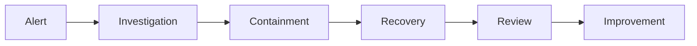

# 🔐 SECURITY ARCHITECTURE

> Official Security Architecture for the Telepizza Platform.

---

# Document Information

| Property | Value |
|----------|-------|
| Project | Telepizza Platform |
| Module | Security |
| Document | SECURITY_ARCHITECTURE.md |
| Version | 1.0.0 |
| Status | Final |
| Last Updated | 07 July 2026 |

---

# 1. Purpose

This document defines the security architecture for the Telepizza Platform.

Security objectives:

- Confidentiality
- Integrity
- Availability
- Privacy
- Compliance
- Secure AI Integration
- Zero Trust Architecture

---

# 2. Security Principles

The platform follows:

- Zero Trust
- Least Privilege
- Defense in Depth
- Secure by Default
- Principle of Separation
- Continuous Verification

---

# 3. Security Architecture

```mermaid
flowchart TD

User --> Cloudflare
Cloudflare --> WAF
WAF --> Nginx
Nginx --> API

API --> Authentication
API --> Authorization
API --> Validation
API --> Audit

API --> Database
API --> Redis
API --> AI Gateway

Database --> Encryption
AI Gateway --> Model Providers

Audit --> Monitoring
Monitoring --> Alerts
```

---

# 4. Identity Management

Supported authentication:

- Email + Password
- Phone + OTP
- Social Login (Future)
- MFA (Future)

Passwords:

- Argon2id (preferred)
- bcrypt (legacy compatibility)

Never store plaintext passwords.

---

# 5. Authentication

Use:

- JWT Access Token
- Refresh Token
- Token Rotation
- Device Tracking
- Session Expiration

---

# 6. Authorization

Use Role-Based Access Control (RBAC).

Roles include:

- Super Admin
- Admin
- Branch Manager
- Cashier
- Kitchen Staff
- Rider
- Customer
- AI Agent

Future:

Attribute-Based Access Control (ABAC).

---

# 7. API Security

Protect APIs using:

- HTTPS
- JWT
- Rate Limiting
- Input Validation
- Output Sanitization
- CORS
- Security Headers
- Idempotency Keys (critical operations)

---

# 8. Input Validation

Validate:

- JSON
- Query Parameters
- Path Parameters
- File Uploads
- Headers

Reject invalid requests.

---

# 9. Data Encryption

Data in Transit:

- TLS 1.2+
- HTTPS only

Data at Rest:

- Database encryption where supported
- Encrypted backups
- Encrypted object storage

Sensitive values:

- Passwords
- API Keys
- Tokens
- Secrets

---

# 10. Secrets Management

Never store secrets in Git.

Use:

- Environment Variables (Development)
- Secret Manager (Production)

Examples:

DATABASE_URL

JWT_SECRET

REDIS_URL

OPENAI_API_KEY

SMTP_PASSWORD

---

# 11. Database Security

- Private network only
- Least privilege database users
- Parameterized queries
- Prisma ORM
- Regular backups
- Audit logging

---

# 12. AI Security

Protect:

- Prompt Templates
- AI API Keys
- AI Usage Logs
- Prompt History

Apply:

- Prompt validation
- Cost limits
- Permission checks
- Human approval for sensitive actions

---

# 13. Infrastructure Security

- Cloudflare
- WAF
- Firewall
- Private Docker Network
- Restricted Ports
- Automatic Security Updates

---

# 14. Logging & Auditing

Audit:

- Login
- Logout
- Role Changes
- Permission Changes
- Payments
- Refunds
- AI Approvals
- Configuration Changes

Logs must include:

- Timestamp
- User
- Branch
- IP Address
- Request ID

---

# 15. Monitoring

Monitor:

- Failed Logins
- Brute Force Attempts
- API Abuse
- Rate Limit Violations
- Database Errors
- AI Usage
- Infrastructure Health

---

# 16. Incident Response

Incident flow:



---

# 17. Backup Security

Backups must be:

- Encrypted
- Versioned
- Tested
- Access Controlled

---

# 18. Secure Development Lifecycle

Every feature must pass:

- Code Review
- Lint
- Tests
- Security Scan
- Dependency Scan
- Secret Scan

before deployment.

---

# 19. Compliance Goals

Design for alignment with applicable requirements such as:

- PCI DSS (payments, if applicable)
- GDPR (if serving EU customers)
- Local privacy regulations
- Internal security policies

Compliance requirements should be validated based on the deployment region and business operations.

---

# 20. Business Continuity

Security planning includes:

- Disaster Recovery
- Backup Verification
- Rollback Procedures
- Monitoring
- High Availability

---

# 21. Future Enhancements

- MFA Enforcement
- Hardware Security Keys
- Single Sign-On (SSO)
- AI Threat Detection
- Automated Security Response
- Zero Trust Network Access

---

# 22. Related Documents

- SECURITY_REQUIREMENTS.md
- API_ARCHITECTURE.md
- DEVOPS_ARCHITECTURE.md
- MONITORING_ARCHITECTURE.md
- DEPLOYMENT_ARCHITECTURE.md

---

© 2026 Telepizza Pakistan

Powered by Mianx.ai