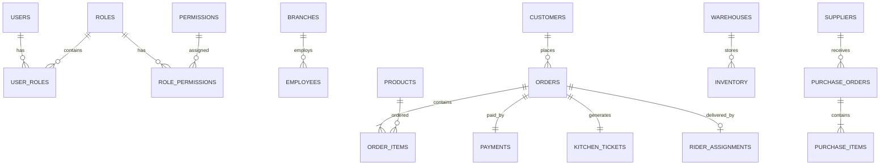

# 🗺️ ENTITY RELATIONSHIP DIAGRAM (ERD)

> Master Entity Relationship Guide for the Telepizza Platform.

---

# Document Information

| Property | Value |
|----------|-------|
| Project | Telepizza Platform |
| Module | Database Engineering |
| Document | ERD.md |
| Version | 1.0.0 |
| Status | Engineering |
| Last Updated | 07 July 2026 |

---

# 1. Purpose

This document defines the complete Entity Relationship Model (ERD) of the Telepizza Platform.

Objectives:

- Database visualization
- Relationship documentation
- Foreign key mapping
- Domain boundaries
- DDD aggregates
- Engineering reference

---

# 2. Database Domains

The platform is divided into the following bounded contexts:

```text
Authentication

Users

Branches

Customers

Menu

Orders

Kitchen

Delivery

Inventory

Warehouse

Suppliers

Purchase

CRM

HR

Finance

AI Platform

Notifications

Audit
```

---

# 3. High-Level ER Diagram



---

# 4. Authentication Domain

Entities

- Users
- Roles
- Permissions
- UserRoles
- RolePermissions
- Sessions
- RefreshTokens

Relationships

```text
User

↓

UserRole

↓

Role

↓

RolePermission

↓

Permission
```

---

# 5. Customer Domain

Entities

- Customers
- Addresses
- LoyaltyAccounts
- Coupons
- CustomerFeedback

Relationships

```text
Customer

↓

Orders

↓

Payments
```

---

# 6. Menu Domain

Entities

- Categories
- Products
- Variants
- Addons
- Menus

Relationships

```text
Category

↓

Products

↓

Variants

↓

Addons
```

---

# 7. Order Domain

Entities

- Orders
- OrderItems
- OrderStatusHistory
- Discounts
- Taxes

Relationships

```text
Customer

↓

Order

↓

OrderItems

↓

Product
```

---

# 8. Kitchen Domain

Entities

- KitchenTickets
- KitchenStations
- PreparationQueue

Relationships

```text
Order

↓

KitchenTicket

↓

KitchenStation
```

---

# 9. Delivery Domain

Entities

- Riders
- RiderAssignments
- DeliveryTracking
- DeliveryZones

Relationships

```text
Order

↓

Assignment

↓

Rider
```

---

# 10. Inventory Domain

Entities

- Inventory
- InventoryTransactions
- StockAdjustments

Relationships

```text
Warehouse

↓

Inventory

↓

Product
```

---

# 11. Warehouse Domain

Entities

- Warehouses
- WarehouseLocations
- StockTransfers

---

# 12. Purchase Domain

Entities

- Suppliers
- PurchaseOrders
- PurchaseItems
- GoodsReceiving
- SupplierReturns

---

# 13. Finance Domain

Entities

- Payments
- Refunds
- Expenses
- Invoices

---

# 14. HR Domain

Entities

- Employees
- Departments
- Attendance
- Payroll
- Leaves

---

# 15. CRM Domain

Entities

- Campaigns
- Loyalty
- Rewards
- CustomerNotes

---

# 16. AI Platform

Entities

- AIAgents
- AITasks
- PromptTemplates
- PromptHistory
- AIUsageLogs
- AIModels

---

# 17. Notifications

Entities

- Notifications
- NotificationTemplates
- NotificationLogs

---

# 18. Audit

Entities

- AuditLogs
- LoginHistory
- ActivityLogs

---

# 19. Cardinality Rules

```text
1 User

↓

Many Orders

-----------------------

1 Order

↓

Many Order Items

-----------------------

1 Product

↓

Many Order Items

-----------------------

1 Warehouse

↓

Many Inventory Items

-----------------------

1 Supplier

↓

Many Purchase Orders
```

---

# 20. Foreign Key Standards

Naming convention:

```text
customerId

orderId

productId

branchId

warehouseId

supplierId
```

Every relationship must use explicit foreign keys.

---

# 21. Aggregate Boundaries (DDD)

Authentication Aggregate

- User
- Role
- Permission

Order Aggregate

- Order
- OrderItems
- Payment
- KitchenTicket

Inventory Aggregate

- Inventory
- StockTransaction
- Warehouse

Purchase Aggregate

- PurchaseOrder
- PurchaseItem
- Supplier

Customer Aggregate

- Customer
- Loyalty
- Coupons

---

# 22. Future Expansion

Reserved domains:

- Franchise
- Marketing Automation
- AI Workforce
- Multi-country Support
- Accounting ERP
- Analytics Warehouse

---

# 23. Engineering Usage

This document is the reference for:

- schema.prisma
- PostgreSQL
- Prisma Migrations
- Backend Services
- Repository Layer
- API Design
- Reporting

---

# 24. Related Documents

- DATABASE_ENGINEERING.md
- DATABASE_SCHEMA.md
- DATABASE_RELATIONSHIPS.md
- DATABASE_ARCHITECTURE.md
- PRISMA_GUIDE.md

---

© 2026 Telepizza Pakistan

Powered by Mianx.ai
