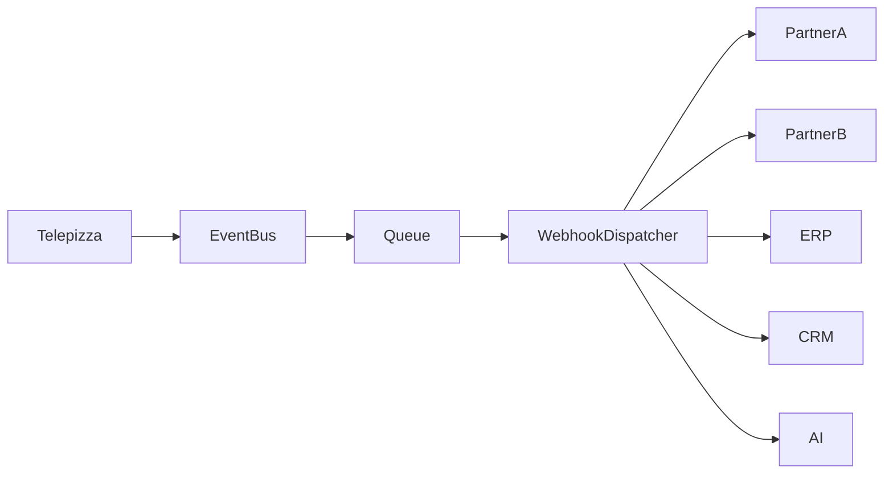

# 🔔 WEBHOOK SPECIFICATIONS

> Official Webhook Engineering Specification for the Telepizza Platform.

---

# Document Information

| Property | Value |
|----------|-------|
| Project | Telepizza Platform |
| Module | API Engineering |
| Document | WEBHOOK_SPECIFICATIONS.md |
| Version | 1.0.0 |
| Status | Engineering |
| Last Updated | 07 July 2026 |

---

# 1. Purpose

This document defines the webhook architecture, payload standards, security, retry policy, and integration rules for the Telepizza Platform.

Objectives

- Secure webhook communication
- Reliable event delivery
- Third-party integration
- Event consistency
- Idempotent processing
- Scalable event architecture

---

# 2. Webhook Overview

Webhooks allow external systems to receive real-time events.

Examples

- Payment Completed
- Order Created
- Order Delivered
- Refund Issued
- Customer Registered
- Inventory Updated
- AI Task Completed

---

# 3. Architecture



---

# 4. Endpoint Format

Example

```text
POST https://partner.example.com/webhooks/orders
```

Content Type

```http
application/json
```

---

# 5. Supported Events

Authentication

- user.created
- user.updated
- user.deleted

Customer

- customer.created
- customer.updated

Order

- order.created
- order.confirmed
- order.preparing
- order.ready
- order.dispatched
- order.delivered
- order.cancelled

Payment

- payment.created
- payment.completed
- payment.failed
- payment.refunded

Inventory

- inventory.updated
- stock.adjusted
- stock.transferred

Kitchen

- kitchen.ticket.created
- kitchen.ticket.completed

AI

- ai.task.completed
- ai.task.failed

---

# 6. Payload Format

```json
{
  "event": "order.created",
  "eventVersion": "1.0",
  "eventId": "uuid",
  "timestamp": "2026-07-07T12:00:00Z",
  "data": {},
  "metadata": {
    "branchId": "uuid",
    "requestId": "uuid"
  }
}
```

---

# 7. HTTP Headers

Required

```http
Content-Type: application/json

X-Webhook-Event: order.created

X-Webhook-Id: uuid

X-Webhook-Timestamp: ISO8601

X-Webhook-Signature: sha256=...
```

---

# 8. Security

Every webhook must use

- HTTPS
- HMAC SHA-256 Signature
- Timestamp Validation
- Replay Protection
- IP Allowlisting (optional)

Never expose secrets.

---

# 9. Signature Verification

Receiver should

1. Read raw request body
2. Calculate HMAC
3. Compare signatures
4. Reject invalid requests

---

# 10. Idempotency

Every event contains

```text
eventId
```

Consumers should ignore duplicate events using the unique `eventId`.

---

# 11. Retry Policy

Retry on

- Timeout
- 429
- 500
- 502
- 503
- 504

Suggested schedule

```text
1 minute

↓

5 minutes

↓

15 minutes

↓

30 minutes

↓

1 hour
```

Maximum retries

```text
5
```

---

# 12. Dead Letter Queue

After retry limit:

Move event to

```text
Dead Letter Queue (DLQ)
```

Log:

- Event ID
- Endpoint
- Response Code
- Error
- Retry Count

---

# 13. Delivery Status

States

- Pending
- Processing
- Delivered
- Failed
- Retrying
- Dead Letter

---

# 14. Timeout

Maximum request timeout

```text
10 seconds
```

Slow endpoints should acknowledge quickly and process asynchronously.

---

# 15. Event Versioning

Every payload includes

```text
eventVersion
```

Example

```text
1.0

1.1

2.0
```

Breaking changes require a new event version.

---

# 16. Webhook Logging

Log

- Event ID
- Event Type
- Endpoint
- Status Code
- Response Time
- Retry Count
- Timestamp

---

# 17. Monitoring

Monitor

- Success Rate
- Failure Rate
- Retry Count
- Queue Size
- Average Delivery Time

---

# 18. Best Practices

- Return HTTP 200 immediately after successful validation.
- Process heavy work asynchronously.
- Keep payloads minimal.
- Include only required fields.
- Use UTC timestamps.
- Never send confidential information unless required.

---

# 19. Testing

Verify

- Signature validation
- Retry handling
- Duplicate event handling
- Timeout handling
- Invalid payload rejection
- Version compatibility

---

# 20. Related Documents

- API_SPECIFICATIONS.md
- API_VERSIONING.md
- API_ERROR_HANDLING.md
- SECURITY_ARCHITECTURE.md
- EVENT_DRIVEN_ARCHITECTURE.md

---

© 2026 Telepizza Pakistan

Powered by Mianx.ai
