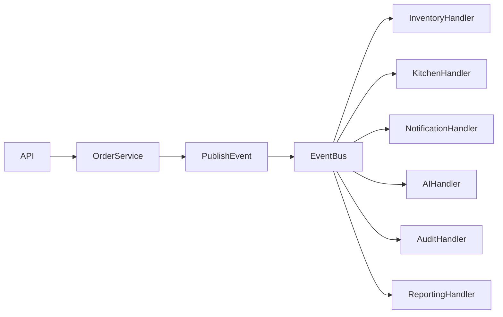

# ⚡ EVENT HANDLERS

> Official Event-Driven Engineering Guide for the Telepizza Platform.

---

# Document Information

| Property | Value |
|----------|-------|
| Project | Telepizza Platform |
| Module | Backend Engineering |
| Document | EVENT_HANDLERS.md |
| Version | 1.0.0 |
| Status | Engineering |
| Last Updated | 07 July 2026 |

---

# 1. Purpose

This document defines how domain events, integration events, event handlers, background processing, and asynchronous workflows are implemented throughout the Telepizza Platform.

Objectives

- Loose coupling
- High scalability
- Reliable event processing
- AI-friendly architecture
- Future microservice readiness

---

# 2. Event-Driven Architecture



---

# 3. Event Categories

## Domain Events

Represent business actions.

Examples

- OrderCreated
- OrderCancelled
- PaymentCompleted
- InventoryAdjusted
- CustomerRegistered

---

## Integration Events

Used for external systems.

Examples

- PaymentWebhookReceived
- ERPInventorySynced
- SMSDelivered
- EmailSent

---

## System Events

Infrastructure events.

Examples

- UserLoggedIn
- CacheInvalidated
- BackupCompleted
- HealthCheckFailed

---

# 4. Event Naming

Use PascalCase.

Examples

```text
OrderCreated

OrderConfirmed

OrderPrepared

OrderDelivered

PaymentCompleted

InventoryTransferred
```

File naming

```text
order-created.event.ts

payment-completed.event.ts
```

---

# 5. Event Structure

Example

```typescript
export class OrderCreatedEvent {

  constructor(

    public readonly orderId: string,

    public readonly customerId: string,

    public readonly branchId: string

  ) {}

}
```

Events should remain immutable.

---

# 6. Event Flow

```mermaid
flowchart TD

CreateOrder

↓

Save Database

↓

Commit Transaction

↓

Publish Event

↓

Execute Handlers

↓

Background Jobs

↓

Notifications
```

Publish events only after successful database transactions.

---

# 7. Handler Responsibilities

Handlers may:

- Send Notifications
- Update Inventory
- Generate Kitchen Tickets
- Trigger AI Workflows
- Write Audit Logs
- Update Reports

Handlers should not modify unrelated business rules.

---

# 8. Event Folder Structure

```text
events/

order-created.event.ts

payment-completed.event.ts

inventory-updated.event.ts

customer-created.event.ts

handlers/

order-created.handler.ts

payment-completed.handler.ts

inventory-updated.handler.ts
```

---

# 9. Event Publishing

Services publish events.

Example

```typescript
this.eventBus.publish(

  new OrderCreatedEvent(...)

);
```

Controllers must never publish events directly.

---

# 10. Background Processing

Long-running work should execute asynchronously.

Examples

- Email
- WhatsApp
- SMS
- AI Processing
- PDF Generation
- Report Generation

Use BullMQ workers.

---

# 11. Retry Strategy

Retry transient failures.

Suggested policy

- Attempt 1
- Retry after 1 minute
- Retry after 5 minutes
- Retry after 15 minutes
- Retry after 30 minutes

Maximum retries: 5

---

# 12. Dead Letter Queue

Failed events after all retries are moved to a Dead Letter Queue.

Store:

- Event ID
- Event Type
- Payload
- Error
- Retry Count
- Timestamp

Provide administrative tools to inspect and replay events.

---

# 13. Event Versioning

Every event should include a version.

Example

```text
OrderCreated

Version 1.0
```

Breaking payload changes require a new version.

---

# 14. Event Logging

Log:

- Event ID
- Event Name
- Aggregate ID
- Handler Name
- Processing Time
- Status
- Retry Count

---

# 15. Event Monitoring

Monitor

- Published Events
- Failed Events
- Queue Length
- Retry Count
- Processing Time
- Dead Letter Queue Size

---

# 16. Event Idempotency

Every event includes a unique Event ID.

Handlers must safely ignore duplicate deliveries.

---

# 17. Outbox Pattern (Future)

For distributed systems:

```text
Business Transaction

↓

Outbox Table

↓

Background Publisher

↓

Event Bus
```

Prevents lost events after successful commits.

---

# 18. Saga Pattern (Future)

Use Saga orchestration for long-running workflows.

Examples

- Order Lifecycle
- Refund Process
- Purchase Workflow
- Stock Transfer

---

# 19. AI Integration

AI can subscribe to:

- OrderCreated
- CustomerFeedbackReceived
- InventoryLow
- SalesCompleted
- PaymentFailed

Possible AI actions:

- Demand Forecasting
- Upsell Recommendations
- Fraud Detection
- Inventory Optimization

---

# 20. Security

Validate:

- Event source
- Event schema
- Authorization
- Payload integrity

Never expose secrets inside event payloads.

---

# 21. Testing

Every handler requires:

- Unit Tests
- Integration Tests
- Retry Tests
- Duplicate Event Tests

---

# 22. Best Practices

- Keep events immutable.
- Publish after successful transactions.
- Keep payloads minimal.
- Make handlers idempotent.
- Separate domain and integration events.
- Monitor failed events.

---

# 23. Related Documents

- BACKEND_BLUEPRINT.md
- MODULE_TEMPLATE.md
- NESTJS_GUIDELINES.md
- EVENT_DRIVEN_ARCHITECTURE.md
- WEBHOOK_SPECIFICATIONS.md

---

© 2026 Telepizza Pakistan

Powered by Mianx.ai
