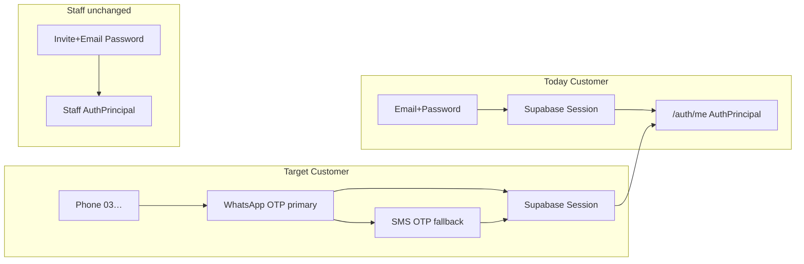

# Sprint 3 — Slice 2C Customer Phone + OTP Architecture

**Status:** Architecture complete — WhatsApp-first · **D11 APPROVED** · Engineering **PAUSED** pending 2C.0 provider READY  
**Type:** Complete blueprint + security review  
**Audience:** Owner (business decisions) · Architects · AI implementation agents  
**Depends on:** Canonical `docs/architecture/AUTHENTICATION_ARCHITECTURE.md`  
**Baseline:** Slice 2B **CLOSED** (`8527f28` / PR #31) — staff invites production-verified  
**Catalog freeze:** v1.2.0 menu/pricing/catalog/toppings — **do not touch**  
**Ops readiness:** `docs/architecture/SLICE-2C0-OTP-OPERATIONS-READINESS.md` (**BLOCKED** on Meta/Twilio)  
**Parallel:** `docs/architecture/SPRINT-04-ORDERS-BACKEND-PLANNING.md`

```text
✅ Sprint 3 Slice 2B Complete (staff invites)
        ↓
✅ D1–D10 approved (SMS-first) → OWNER OVERRIDE on D1/D7
        ↓
🎯 WhatsApp-first OTP architecture (THIS DOCUMENT)
        ↓
2C.0 ops readiness → owner checklist → 2C.1+ code (only when READY)
```

**Hard constraints (non-negotiable):**

- Preserve staff email/password auth  
- Preserve Staff Invite Slice 2B (no breakage of invite conflict / accept rules)  
- Phone OTP must **never** create staff roles  
- Auto-assign **`customer` only**  
- Do not touch menu, pricing, catalog, POS, Admin, orders, or operational RLS (Slice 2D)  
- Google OAuth remains **disabled**  
- OTP delivery: **Meta authentication templates only** — never free-form WhatsApp messages  
- No provider secrets in git / chat / PR bodies  
- No branch / code / migrations / commits in this planning revision  

---

## Executive summary

Slice 2C moves the **customer** journey from interim email/password to **Pakistan mobile phone + OTP**, with **WhatsApp as the primary delivery channel** (core Telepizza ordering and customer-communication channel), **SMS as fallback**, and **email/password as a temporary pilot fallback**. Staff continue on email/password + invite activation.

| Principle | Rule |
|---|---|
| Identity | One phone → one Supabase Auth user (`auth.users.phone`) → JWT → `getUser` |
| Delivery order | **1. WhatsApp OTP** → **2. SMS OTP** → **3. Email/password (pilot)** |
| Provider | **Twilio Verify** (WhatsApp primary channel + SMS fallback) |
| Templates | Meta **Authentication** templates only (Copy Code); never free-form OTP |
| Phone form | UI accepts `03XXXXXXXXX`; store canonical `+923XXXXXXXXX` |
| Channel switch | Same E.164 identity; **no duplicate accounts** when switching WhatsApp ↔ SMS |
| Staff isolation | OTP bootstrap cannot mint staff; staff phones conflict with customer OTP |
| Cutover | Phone OTP default CTA only after Multan pilot PASS (D10) |

---

## 0. Owner override — delivery order (locked)

| Priority | Channel | Role in V1 |
|---|---|---|
| **1** | **WhatsApp OTP** | **Primary / default** OTP channel |
| **2** | **SMS OTP** | Explicit fallback when WhatsApp fails or user chooses “Send via SMS” |
| **3** | **Email/password** | Temporary pilot fallback (D8); staff forever |

**Updated decisions:**

| ID | Previous | **Now (owner override)** |
|---|---|---|
| **D1** | Twilio Verify (SMS) for Multan pilot | **Twilio Verify with WhatsApp as primary channel** for Multan pilot |
| **D7** | No WhatsApp OTP in V1 | **WhatsApp OTP INCLUDED in V1 and is the default OTP channel** |

All other approved decisions (D2–D6, D8–D10) remain in force.

---

## 1. Current email/password flow vs target phone OTP flow

### 1.1 Current (production — Slice 1 + 2A + 2B)

```text
Register/Login UI (email + password)
    → supabase.auth.signUp / signInWithPassword
    → Supabase session (localStorage)
    → AuthContext onAuthStateChange
    → GET /api/v1/auth/me (Bearer)
    → AuthPrincipal from public.users + user_roles
    → roles = ["customer"], permissions = []

Bootstrap (DB trigger on auth.users insert):
    → public.users (phone=null, user_type=customer)
    → user_roles += customer (global)
    → NEVER creates public.customers row (phone NOT NULL)
```

| Surface | Today |
|---|---|
| Website | `/register`, `/login`, `/account` |
| Ordering WhatsApp | `wa.me` deep link to **0304-1110495** (BFR-013 locked) — consumer chat, **not** Cloud API |
| Backend password login | `POST /auth/login` = **501** (client uses Supabase directly) |
| Staff | Email/password + `/staff/accept` invite (Slice 2B) |
| Customer permissions | Empty allowlist |
| Phone on profile | Optional / usually null; Account UI says phone “later” |

### 1.2 Target (Slice 2C — WhatsApp-first)

```text
Name (optional) → Phone (03…) → Send code on WhatsApp
    → (optional) Resend on WhatsApp
    → (optional) Send via SMS fallback
    → Enter OTP → Session
    → auth.users.phone = +923…  (ONE identity regardless of channel)
    → public.users.phone synced unique
    → customer role only
    → /auth/me unchanged contract (phone populated on profile)
```

| Concern | Email path (keep) | Phone OTP path (add) |
|---|---|---|
| Who uses it | Staff always; customers during pilot | Customers (primary after D10 cutover) |
| Credential | Password | WhatsApp/SMS OTP (no customer password required) |
| Privilege mint | Customer bootstrap only | Customer bootstrap only |
| Linking | N/A | Explicit linking when email-only account exists (D6) |



---

## 2. Provider strategy (Twilio Verify + Meta WhatsApp)

### 2.1 Why Twilio Verify

| Need | Fit |
|---|---|
| WhatsApp OTP via Meta auth templates | Twilio Verify **Bring Your Own WhatsApp Sender** |
| SMS fallback on same Verify Service | Same OTP code across channels in one verification session |
| Supabase Phone Login | Official support for Twilio / Twilio Verify; `channel: "whatsapp"` |
| Fraud / pumping | Verify Fraud Guard |
| Multan pilot | Fastest path vs custom PTA gateway |

### 2.2 Channel rules (non-negotiable)

1. Use an **approved Telepizza WhatsApp Business** sender (WABA).  
2. Deliver OTP **only** via Meta **Authentication** templates (Copy Code).  
3. **Never** send OTP through ordinary free-form WhatsApp messages (ordering chat, marketing, or ad-hoc support replies).  
4. SMS fallback uses Verify `channel=sms` against the **same** E.164 phone / verification identity.  
5. Switching WhatsApp → SMS must **not** create a second `auth.users` row.

### 2.3 Client API sketch

```text
# Primary
signInWithOtp({ phone: "+923…", options: { channel: "whatsapp" } })

# Resend (WhatsApp)
signInWithOtp({ phone: "+923…", options: { channel: "whatsapp" } })  # after ≥60s

# Explicit SMS fallback
signInWithOtp({ phone: "+923…", options: { channel: "sms" } })

# Verify (channel-agnostic — same phone + code)
verifyOtp({ phone: "+923…", token: "123456", type: "sms" })
```

Supabase documents WhatsApp as supported **only** for Twilio / Twilio Verify providers. Verify success binds the **phone**, not the transport channel.

### 2.4 Scale path (post-pilot)

If WhatsApp/SMS cost or PK delivery fails Multan PASS criteria → evaluate Auth Hook → local PTA SMS + separate WABA ops. Do not change D1 mid-pilot without owner sign-off.

---

## 3. WhatsApp sender-number decision (critical)

### 3.1 Candidate: ordering number `0304-1110495`

| Fact | Detail |
|---|---|
| Locked brand phone | BFR-013 — **0304-1110495** / intl **923041110495** |
| Current use | Website cart/checkout `wa.me/92…` handoff; human Multan order intake |
| Stack today | **Consumer WhatsApp deep link** — **not** WhatsApp Cloud API / Twilio Messaging inbox |

### 3.2 Can `0304-1110495` be the Verify WhatsApp API sender?

| Risk | Impact |
|---|---|
| Migrating the number onto WhatsApp Business Platform / Cloud API for Twilio | Changes how customers reach “Telepizza” chat; often **breaks or transforms** phone-app / `wa.me` free-form ordering unless ordering is rebuilt on Cloud API |
| Mixing OTP auth templates with live order conversations on one sender | Ops confusion; customers reply OTP codes into order threads; higher block/report risk |
| Twilio / Meta guidance | Prefer **dedicated** sender for authentication vs marketing/conversational use |
| Dual-purpose without Cloud API migration | **Not viable** — Verify WhatsApp requires a registered WhatsApp **Sender** on a WABA, which is incompatible with “keep `wa.me` human chat unchanged” |

**Verdict:** **Do not onboard `0304-1110495` as the Twilio Verify WhatsApp sender** for the Multan pilot if preserving today’s WhatsApp ordering workflow is required.

### 3.3 Recommendation (default for architecture)

| Role | Number | Purpose |
|---|---|---|
| **Ordering (keep)** | **0304-1110495** | `wa.me` checkout + human order chat — **unchanged** |
| **Authentication (new)** | **Dedicated Telepizza WABA sender** | Twilio Verify WhatsApp OTP only |

**Branding:** WABA display name clearly Telepizza (e.g. **“Telepizza”** or **“Telepizza Login”**) so customers trust the auth message; copy states it is a login code, not an order confirmation.

**Owner decision D11:** ✅ **APPROVED** — dedicated auth sender; keep **0304-1110495** ordering-only (no Cloud API migration of ordering number).

---

## 4. Phone normalization rules

### 4.1 Accept (UI / API input)

| Form | Example | Allowed? |
|---|---|---|
| Local mobile | `03XXXXXXXXX` (11 digits, starts with `03`) | ✅ Primary UX |
| Already E.164 PK | `+923XXXXXXXXX` | ✅ Normalize to same |
| `0092…` / `92…` without `+` | `923001234567` | ✅ Normalize |
| Landline / short codes | — | ❌ Reject |
| Non-PK numbers | — | ❌ Reject in 2C v1 (D2) |

**Local pattern (recommended):** `^03[0-9]{9}$`

### 4.2 Canonical storage

| Layer | Format |
|---|---|
| `auth.users.phone` | E.164 **`+923XXXXXXXXX`** |
| `public.users.phone` | Same canonical string; **UNIQUE** |
| Display in UI | Prefer `03XXXXXXXXX` |

```text
03XXXXXXXXX  →  +92 + XXXXXXXXXX   (strip one leading 0)
```

### 4.3 Security notes

- Normalize **before** OTP send and **before** uniqueness checks.  
- Re-validate server-side; never trust client-normalized claims.  
- Log only masked phones (`+923******4567`).

---

## 5. OTP lifecycle (WhatsApp-first)

| Stage | Behavior | Telepizza policy |
|---|---|---|
| **Request (primary)** | `signInWithOtp` + `channel: "whatsapp"` | After normalize + CAPTCHA (prod) + rate limit |
| **Deliver** | Meta Authentication template via Verify | Brand + 6-digit code + Copy Code; **no** free-form |
| **Resend** | WhatsApp again | ≥ **60s**; counts toward 3/hour & 10/day |
| **SMS fallback** | `channel: "sms"` | User-initiated or after WhatsApp failure; same phone |
| **Verify** | `verifyOtp({ phone, token, type: 'sms' })` | Success → session; bootstrap customer if needed |
| **Expiry** | Provider + Auth TTL | **10 minutes** (D3) |
| **Rate limiting** | Auth + Telepizza policy | Phone / IP / device; 3/hour, 10/day (D4) |
| **Lockout** | Failed verify attempts | **5 fails → 15 min** (D5) |

```text
request_otp(channel=whatsapp|sms)
  → validate + normalize phone (+92 only)
  → check not staff-linked phone
  → check rate limits / lockout / CAPTCHA
  → supabase.auth.signInWithOtp({ channel })
  → audit event (masked phone, channel, ip, ua) — no code
  → UI: enter code

verify_otp
  → normalize phone + code
  → check lockout
  → supabase.auth.verifyOtp  # same identity for WA or SMS code
  → ensure public.users + customer role only
  → sync public.users.phone = canonical
  → return session; client calls /auth/me
```

**Same identity rule:** WhatsApp and SMS must verify the **same** `+923…` subject. Twilio Verify can deliver the **same** OTP across channels in one verification session; Telepizza must never mint a second auth user when the user taps “Send via SMS”.

**Do not** invent a parallel OTP table as the primary source of truth — prefer Auth + Verify; add Telepizza audit/rate/webhook tables as supplements.

---

## 6. Existing-account linking

| Case | Required behavior | Error / UX |
|---|---|---|
| **A. Email-only customer** | No silent merge | **Explicit linking** (D6) |
| **B. Existing phone customer** | OTP login returns same auth user (any channel) | Happy path |
| **C. Duplicate phone** | Second subject cannot claim phone | `PHONE_CONFLICT` |
| **D. Staff phone conflict** | Refuse customer OTP mint | `PHONE_STAFF_CONFLICT` |
| **E. Channel switch WA↔SMS** | Same phone → same user | Never duplicate |

**Invariant:** OTP verification must never assign staff roles, finalize invites, delete staff roles, or change `user_type` away from customer for OTP-created sessions (refuse if already staff).

---

## 7. Database changes (planned — not authored in this phase)

Forward-only migrations only after 2C.0 READY + implementation authorization.

| Change | Purpose |
|---|---|
| Harden `ensure_customer_profile_for_auth_user` | Sync `public.users.phone` from `auth.users.phone`; customer only |
| Optional phone check constraint | Enforce `^\+923[0-9]{9}$` on non-null phones |
| `customer_auth_events` (append-only) | Audit request/verify/fail/lockout/channel (no OTP codes) |
| Rate-limit helpers / tables | Per-phone, per-IP, per-device counters |
| Delivery / webhook events | WhatsApp (and SMS) status + latency tracking (see §11) |

**Non-goals:** mandatory `public.customers` rows; order/payment RLS; staff_invites schema changes (except phone conflict helpers); menu/catalog edits.

---

## 8. Supabase Auth phone-provider requirements

| Requirement | Notes |
|---|---|
| Enable Phone provider | Dashboard → Auth → Providers → Phone |
| Provider | **Twilio Verify** |
| WhatsApp sender | Dedicated Telepizza WABA sender registered with Twilio Verify (BYO) |
| SMS | Enabled on same Verify Service for fallback |
| E.164 | Always `+92…` |
| Client | `signInWithOtp` with `channel: "whatsapp"` \| `"sms"`; `verifyOtp` |
| CAPTCHA | Required in production (D9) |
| Test numbers | Multan SIMs that have **WhatsApp installed** + SMS capability |
| PTA / branded SMS | Not required for WhatsApp-first pilot; SMS From may be rewritten |

---

## 9. RLS and security rules

Authz spine unchanged: Bearer JWT → `getUser` → `AuthPrincipal` (DB) → permissions.

| Area | 2C action |
|---|---|
| Operational order/payment RLS | **Out of scope** (Slice 2D) |
| `public.users` | Own-row read/update; block privilege escalation |
| `user_roles` | Clients cannot mutate |
| Phone uniqueness | DB enforced; safe API errors |

**Security invariants:** OTP cannot mint staff; no OTP codes in logs; generic invalid-OTP errors; staff invite path untouched; no free-form WhatsApp OTP; no frontend OTP bypass.

---

## 10. Customer UI flow

### 10.1 Required CTA copy (V1)

| Action | Label / behavior |
|---|---|
| Primary send | **Send code on WhatsApp** |
| Resend | **Resend on WhatsApp** (disabled until ≥60s) |
| Fallback | **Send via SMS** (explicit secondary control) |
| Pilot escape | **Use email instead** (email/password) |

### 10.2 Screens

1. Continue with phone — optional name + `03…`  
2. Enter OTP — 6 digits; show which channel last used  
3. Linking interstitial if D6 applies  
4. Success → `/account` or deep link  

### 10.3 Login/Register evolution

| Phase | UI |
|---|---|
| Pilot (pre-D10) | Phone OTP available; WhatsApp primary; email still visible |
| After D10 PASS | Phone OTP default CTA; email behind “Use email instead” |
| Staff | Unchanged email password + `/staff/accept` |

---

## 11. Delivery webhooks & latency tracking

| Requirement | Plan |
|---|---|
| WhatsApp delivery webhook | Capture Twilio Verify / Message status callbacks (queued → sent → delivered → failed / undelivered) |
| Latency | Store `requested_at`, `provider_accepted_at`, `delivered_at` (when available); compute median / P95 |
| SMS fallback events | Same event model with `channel=sms` |
| PII | Mask phone; never store OTP codes in webhook payloads retained by Telepizza |
| Implementation slice | Foundations in **2C.1**; full dashboard metrics by **2C.4** Multan smoke |

Without webhook/latency data, Multan pilot PASS (§ pilot criteria in 2C.0) cannot be evidenced.

---

## 12. Failure modes (product + ops)

| Failure | UX | Ops |
|---|---|---|
| Twilio / Meta WhatsApp outage | Offer **Send via SMS**; keep email login | Status; disable WA channel if prolonged |
| Number not on WhatsApp | Detect / user reports → **Send via SMS** | Do not loop WhatsApp retries blindly |
| Delayed WhatsApp (&gt;60s) | Wait copy; allow resend after 60s; then SMS | Check Verify + WABA quality |
| Wrong code | “Invalid code” | Count toward lockout |
| Expired code (&gt;10 min) | “Code expired — request a new one” | Align Verify + Auth TTL |
| Exceeded limits | “Too many attempts — try later” | Review CAPTCHA / Fraud Guard |
| Auth template rejected / not approved | Block WA sends; SMS + email only | Fix Meta template status |
| Provider rejects PK SMS route | WA-only until SMS fixed; email fallback | Twilio support / local SMS later |
| Ordering number wrongly used as auth sender | Risk to `wa.me` orders | **Forbidden** without separate ordering redesign |

---

## 13. Rollback and fallback strategy

**Fallback order (locked):**

1. WhatsApp OTP  
2. SMS OTP  
3. Email/password (pilot)  
4. Owner/admin support (Auth admin tools — **never** invent OTP codes)

| Stage | Rollback |
|---|---|
| Feature flag off | Hide phone UI; email/password only |
| WhatsApp outage | SMS + email |
| Both OTP channels down | Email/password; toggle Phone provider OFF if needed |
| Staff | Never depends on OTP |

**Frontend must never** bypass OTP or accept hardcoded codes.

---

## 14. Cost and abuse controls

| Control | Purpose |
|---|---|
| CAPTCHA on OTP request | Block bots / pumping |
| Per-phone 3/hour & 10/day | D4 |
| Per-IP / device limits | Shared Wi-Fi abuse |
| 5 fails → 15 min lockout | D5 |
| Fraud Guard | Verify |
| Meta auth templates only | Policy + lower spam risk |
| Daily / monthly spend alerts | Cost ceiling |

**Cost sketch (illustrative — confirm Twilio rate card):**

| Component | Typical planning range |
|---|---|
| WhatsApp Verify (auth template) | Often **lower** than PK SMS; WhatsApp undelivered usually not charged the same way as SMS — confirm account rates |
| SMS fallback segment to PK | Often **~$0.25–0.50+** |
| Successful Verify fee | Often **~$0.05** |
| Happy path (WA only, 1 success) | Target **well under $0.50** all-in when WA delivers |
| Retry / SMS fallback | Higher — budget for ~1.2–1.5 messages per successful login in pilot |

Detailed caps and alerts: see `SLICE-2C0-OTP-OPERATIONS-READINESS.md`.

---

## 15. Test plan

### 15.1 Unit / static

- Phone normalize; bootstrap customer-only; staff phone conflict; no catalog diffs  

### 15.2 Integration

- WhatsApp send → verify → `/auth/me`  
- Resend WhatsApp cooldown  
- SMS fallback → **same** user (no duplicate)  
- Rate limit / lockout / CAPTCHA  
- Staff invite regression; email login still works  

### 15.3 Production Multan smoke

| # | Test |
|---|---|
| 1 | WhatsApp-installed Jazz/Zong/Telenor/Ufone SIMs receive **auth template** OTP |
| 2 | Non-WhatsApp / WA-failed path → SMS fallback works |
| 3 | Channel switch does not duplicate accounts |
| 4 | Webhook latency recorded |
| 5 | Ordering `wa.me` to **0304-1110495** still works (regression) |
| 6 | Staff invite + catalog 58/13/2 unchanged |

---

## 16. Owner decision card (D1–D11)

| ID | Question | Decision | Owner |
|---|---|---|---|
| **D1** | Provider / channel for 2C v1? | **Twilio Verify — WhatsApp primary** for Multan pilot | ✅ OVERRIDE |
| **D2** | PK numbers only? | **Yes** (`03` / `+92`) | ✅ |
| **D3** | OTP expiry? | **10 minutes** | ✅ |
| **D4** | Resend / caps? | **≥60s**; **3/hour**; **10/day** | ✅ |
| **D5** | Verify lockout? | **5 failures → 15 min** | ✅ |
| **D6** | Email-only linking? | **Explicit** (no silent merge) | ✅ |
| **D7** | WhatsApp OTP in v1? | **Yes — default OTP channel** | ✅ OVERRIDE |
| **D8** | Keep email/password during pilot? | **Yes** (temporary fallback) | ✅ |
| **D9** | CAPTCHA in production? | **Yes** | ✅ |
| **D10** | Phone OTP default CTA? | **After Multan pilot PASS** | ✅ |
| **D11** | WhatsApp auth sender number? | **Dedicated WABA OTP sender**; display **Telepizza Login**; keep **0304-1110495** ordering-only | ✅ APPROVED |

Architecture is implementation-ready only when 2C.0 ops checklist is green (provider/sender/template/CAPTCHA/pilot).

---

## 17. Exact implementation slices (after 2C.0 READY)

| Slice | Scope | Stop line |
|---|---|---|
| **2C.0** | Twilio Verify + WABA auth sender + Meta auth template + CAPTCHA + ops | No public OTP UX |
| **2C.1** | Phone normalize + bootstrap sync + audit/rate + webhook foundations | Limited test spend |
| **2C.2** | Website UI: Send/Resend WhatsApp + SMS fallback + AuthContext | Email still available |
| **2C.3** | Account linking (D6) + staff phone conflict | No staff UX beyond conflict |
| **2C.4** | Abuse controls + Multan WA/SMS smoke + latency report | Soft launch |
| **2C.5** | Cutover (D10): phone primary CTA | Email fallback retained |

---

## Related documents

| Document | Role |
|---|---|
| `docs/architecture/AUTHENTICATION_ARCHITECTURE.md` | Canonical authz SSOT |
| `docs/architecture/STAFF_INVITE_ARCHITECTURE.md` | Slice 2B — must remain intact |
| `docs/architecture/SLICE-2C-IMPLEMENTATION-BRIEF.md` | Pre-implementation gate brief |
| `docs/architecture/SLICE-2C0-OTP-OPERATIONS-READINESS.md` | Provider & ops readiness |
| `_documentation-audit/reports/SPRINT-03-SLICE-2B-CLOSE.md` | 2B production close |

---

## Agent stop line

Until 2C.0 is **READY** and implementation is authorized:

- Do **not** create a feature branch  
- Do **not** write OTP migrations/routes/UI  
- Do **not** put provider secrets in the repo  
- Do **not** migrate **0304-1110495** onto Cloud API without an explicit ordering redesign  
- Do **not** start Slice 2D / POS unlock  

**Stop for owner review (2C.0 OWNER/PROVIDER checklist).**
